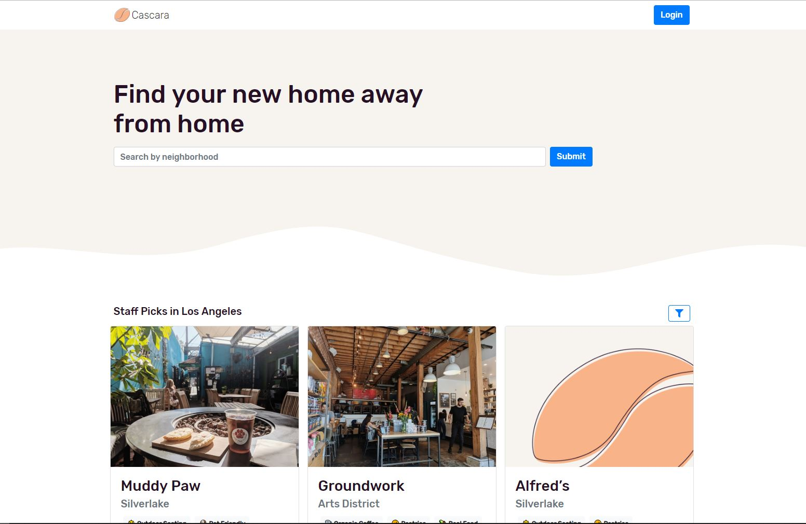

# Cascara - Find Local Coffee

View this project live at [Cascara](https://getcascara.com/). 

Tools Used:
- React.js
- Node.js
- AWS Lambda Functions
- Google Maps API
- Airtable 
- Netlify 
- Bootstrap
- Figma

You can read about how these tools work together in [my Medium article](https://medium.com/@murphystude/up-and-running-with-netlify-airtable-and-react-428959473cf0).
